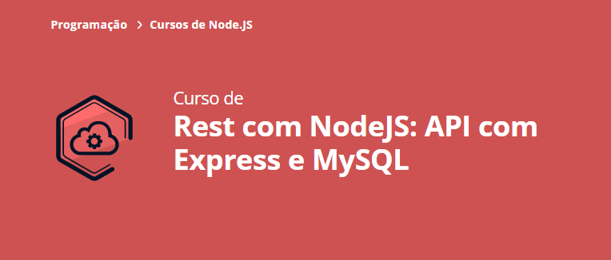

# Rest com NodeJS: API com Express e MySQL: Curso Alura 🧑🏻‍💻

- API
- ⏲️ Carga horária: 8h
### Objetivos do curso:
- Aprender a criar API REST ✔️
- Usar o MySQL para salvar os nossos dados ✔️
- Usar o Express para criar um servidor ✔️
- Aprender a manipular datas com MomentJS ✔️
- Validar os dados antes de enviar para o banco de dados ✔️
- Enviar erros descritivos para o seu usuário ✔️

[link do curso](https://cursos.alura.com.br/course/node-rest-api)